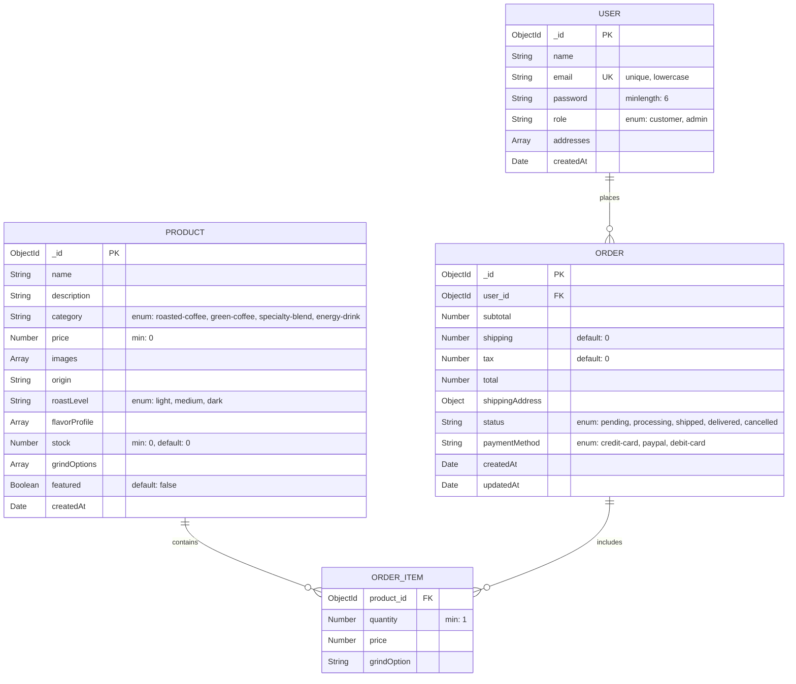

# 📊 Caffeine Corner Database Schema

## Entity Relationship Diagram



## Schema Details

### User Collection
Represents customers and administrators of the platform.

| Field | Type | Required | Description |
|-------|------|----------|-------------|
| `_id` | ObjectId | Yes | Primary key (auto-generated) |
| `name` | String | Yes | User's full name |
| `email` | String | Yes | Unique email address (lowercase) |
| `password` | String | Yes | Hashed password (min 6 characters) |
| `role` | String | Yes | User role: 'customer' or 'admin' (default: 'customer') |
| `addresses` | Array | No | Array of address objects with shipping information |
| `createdAt` | Date | Auto | Timestamp of user creation |

**Indexes:**
- `email` - Unique index

### Product Collection
Stores all coffee products, energy drinks, and related items.

| Field | Type | Required | Description |
|-------|------|----------|-------------|
| `_id` | ObjectId | Yes | Primary key (auto-generated) |
| `name` | String | Yes | Product name |
| `description` | String | Yes | Product description |
| `category` | String | Yes | Product category: 'roasted-coffee', 'green-coffee', 'specialty-blend', 'energy-drink' |
| `price` | Number | Yes | Product price (min: 0) |
| `images` | Array[String] | No | Array of image URLs |
| `origin` | String | No | Coffee origin country/region |
| `roastLevel` | String | No | Roast level: 'light', 'medium', 'dark' |
| `flavorProfile` | Array[String] | No | Array of flavor descriptors |
| `stock` | Number | Yes | Available stock quantity (default: 0) |
| `grindOptions` | Array[String] | No | Available grind options: 'whole-bean', 'coarse', 'medium', 'fine', 'espresso' |
| `featured` | Boolean | Yes | Whether product is featured (default: false) |
| `createdAt` | Date | Auto | Timestamp of product creation |

### Order Collection
Stores customer orders with items and shipping information.

| Field | Type | Required | Description |
|-------|------|----------|-------------|
| `_id` | ObjectId | Yes | Primary key (auto-generated) |
| `user` | ObjectId | Yes | Reference to User (FK) |
| `items` | Array | Yes | Array of order items (embedded schema) |
| `subtotal` | Number | Yes | Order subtotal before tax and shipping |
| `shipping` | Number | Yes | Shipping cost (default: 0) |
| `tax` | Number | Yes | Tax amount (default: 0) |
| `total` | Number | Yes | Total order amount |
| `shippingAddress` | Object | No | Shipping address object |
| `status` | String | Yes | Order status: 'pending', 'processing', 'shipped', 'delivered', 'cancelled' (default: 'pending') |
| `paymentMethod` | String | No | Payment method: 'credit-card', 'paypal', 'debit-card' |
| `createdAt` | Date | Auto | Timestamp of order creation |
| `updatedAt` | Date | Auto | Timestamp of last update |

### Order Item (Embedded Schema)
Embedded within Order documents to store individual items.

| Field | Type | Required | Description |
|-------|------|----------|-------------|
| `product` | ObjectId | Yes | Reference to Product (FK) |
| `quantity` | Number | Yes | Quantity ordered (min: 1) |
| `price` | Number | Yes | Price at time of order |
| `grindOption` | String | No | Selected grind option |

## Relationships

1. **User → Order (One-to-Many)**
   - One user can place multiple orders
   - Order contains reference to user via `user` field

2. **Order → Order Item (One-to-Many)**
   - One order contains multiple order items
   - Order items are embedded within order documents

3. **Product → Order Item (One-to-Many)**
   - One product can appear in multiple order items
   - Order item contains reference to product via `product` field

## Data Flow

```
User Registration/Login
    ↓
Browse Products (Product Collection)
    ↓
Add to Cart → Create Order (Order Collection)
    ↓
Order contains Order Items (referencing Products)
    ↓
Order Processing → Update Order Status
```

## Sample Data

The database includes seed data with:
- 3 Users (1 admin, 2 customers)
- 8 Products (various coffee types and energy drinks)
- 2 Sample Orders

Run `npm run seed` to populate the database with sample data.

